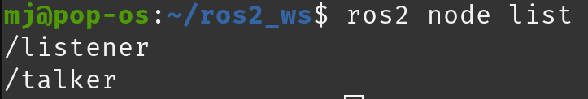
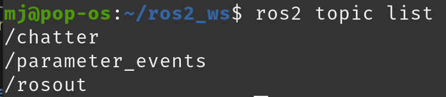
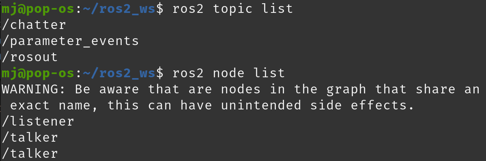

# Setup
> You should install ROS2 Humble on your PC first.

## Initial local setup for workspace
> Before getting packages
```bash
mkdir -p ~/ros2_ws/src
cd ~/ros2_ws
```

## Setup `~/.bashrc`
> This should be in ~/.bashrc for all machines  
> Only `ROS_DOMAIN_ID` is required for the jetson nano (the rest is set automatically from the docker image)  
> To manually add (PC): `sudo nano ~/.bashrc`  
> To check: `env | grep ROS`
```bash
# Source ROS2 Humble environment
source /opt/ros/humble/setup.bash
# Source workspace overlay
source ~/ros2_ws/install/setup.bash
# Setup ROS2 network configuration (for same network)
export ROS_LOCALHOST_ONLY=0
export ROS_DOMAIN_ID=30
# Additional information
export ROS_ROOT=/opt/ros/humble
export ROS_VERSION=2
export ROS_PYPTHON_VERSION=3
export ROS_DISTRO=humble
```

# General Development
## Create custom packages
### Create C++ Package
```bash
ros2 pkg create my_cpp_pkg --dependencies rclcpp std_msgs --build-type ament_cmake --license MIT
```

### Create Python Package
```bash
ros2 pkg create my_python_pkg --dependencies rclpy std_msgs --build-type ament_python --license MIT
```
> Apache-2.0 License
> geometry_msgs for `geometry_msgs/Twist`
```bash
ros2 pkg create motor --dependencies rclpy std_msgs geometry_msgs --build-type ament_python --license Apache-2.0
```

## Fix ROS header issue in VS Code
> You should have a `.vscode/c_cpp_properties.json` at root of workspace  
> This removes any issues with including ROS headers in code
```json
{
    "configurations": [
      {
        "name": "Linux",
        "includePath": [
          "${workspaceFolder}/**",
          "/opt/ros/humble/include/**"
        ],
        "defines": [],
        "compilerPath": "/usr/bin/g++",
        "cStandard": "c11",
        "cppStandard": "c++14",
        "intelliSenseMode": "linux-gcc-x64"
      }
    ],
    "version": 4
  }
```

# Jetson Nano Instructions
## Pull ros-core (ROS2 Humble)
```bash
docker pull dustynv/ros:humble-ros-core-l4t-r32.7.1
```

## Clone this repository
> Clone into root (preferred)  
> OR clone somewhere else and edit `/run/jetson.sh` paths
```bash
git clone https://github.com/MarcusHsieh/ros2_ws.git
```

## Run on ROS container with bind mount
> https://hub.docker.com/r/dustynv/ros/tags?name=humble

Run command:
```bash
./run/jetson.sh
```

## Build ROS workspace
> Root of workspace
```bash
cd /workspace
```
> Cleans old build artifacts (use if colcon build fails)
```bash
rm -rf build install log
```
> For final build
```bash
colcon build --cmake-args -DCMAKE_BUILD_TYPE=Release
```
> For developing:  
> `--symlink-install`: basically compiles only new code 
```bash
colcon build --symlink-install --cmake-args -DCMAKE_BUILD_TYPE=Release
```
```bash
source install/setup.bash
```

# Test if running (PC + Jetson Nano)

## Test with listener and talker nodes
### C++
```bash
ros2 run my_cpp_pkg talker_node
```
```bash
ros2 run my_cpp_pkg listener_node
```

### Python
```bash
ros2 run my_python_pkg talker
```
```bash
ros2 run my_python_pkg listener
```

### Manual checks
> When running a talker, you can manually check data throughput
```bash
ros2 topic echo chatter
```

## Nodes + Topics
> - [Topic = Bulletin board] [Node = Worker]
>   - **Analogy**: Where workers can see or post information
>   - **Technical**: Where nodes can subscribe to or publish information

> - **Node**: Process that performs a computation, controls hardware, or manages a specific task
>   - Control a motor (`/motor_controller`)
>   - Read a sensor (`/camera_driver`)
>   - Plan a path (`/path_planner`)
>   - Provide UI 

> - **Topic**: A bus or channel where nodes exchange messages, pathway for communication
>   - Facilitates *asychronous*, *many to many* communication
>   - Publishing nodes and subscribing nodes do NOT know each other, they only agree on the **topic name** and **type of data** being sent
>   - Topics have **unique names** and a **defined message type**
>     - `/camera/image_raw` topic carries raw image data (Message type: `sensor_msgs/Image`)
>     - `/cmd_vel` topic carries velocity commands (Message type: `geometry_msgs/Twist`)
>     - `/scan` topic carries laser scan data (Message type: `sensor_msgs/LaserScan`)

```bash
ros2 node list
```

```bash
ros2 topic list
```


# Interesting observations and findings
- When running a **Python talker**, **C++ talker**, and **Python listener**
  - Python listener is hearing from BOTH Python AND C++ talker => outputting both published informations
  - This means that even though the language is different, they're still publishing/subscribing to the same node => ROS 2 acting as a neutral middleman


# Final folder structure 
> Only the important bits:
```python
└── 📁ros2_ws
    └── 📁my_cpp_pkg
        └── CMakeLists.txt # defines and bundles all executables to run
        └── 📁include
            └── 📁my_cpp_pkg
                └── listener.hpp # listener function declarations
                └── talker.hpp # talker function declarations
        └── package.xml
        └── 📁src
            └── listener.cpp # listener function definitions
            └── talker.cpp # talker function definitions
    └── 📁my_python_pkg
        └── 📁my_python_pkg
            └── __init__.py
            └── listener.py # listener script
            └── talker.py # talker script
        └── package.xml
        └── 📁resource
            └── my_python_pkg
        └── setup.cfg
        └── setup.py # setup: runs specified scripts/functions
        └── 📁test # used for unit tests (optional)
            └── test_copyright.py
            └── test_flake8.py
            └── test_pep257.py
    └── 📁run
        └── jetson.sh
    └── .gitignore
```
