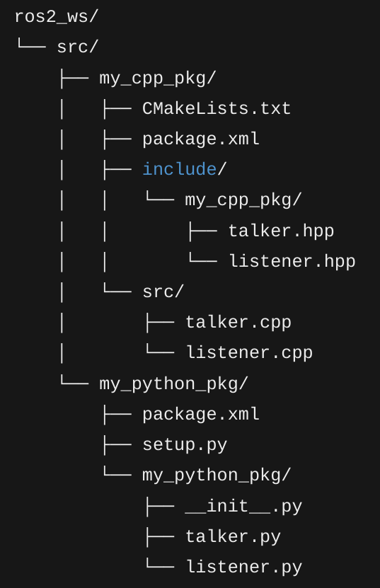

# Setup

## Initial local setup for workspace (before getting packages)
```bash
mkdir -p ~/ros2_ws/src
cd ~/ros2_ws
source /opt/ros/humble/setup.bash
```

## Setup `~/.bashrc`
> For communication over same network
> `env | grep ROS`
> check this part and fix the numpy error for running normal ros2 commands
> This should be in ~/.bashrc for all machines
> `super_client.xml` might be wrong
```bash
export ROS_ROOT=/opt/ros/humble
export ROS_VERSION=2
export ROS_LOCALHOST_ONLY=0
export ROS_PYPTHON_VERSION=3
export ROS_DISTRO=humble
export ROS_DOMAIN_ID=30
export FASTRTPS_DEFAULT_PROFILES_FILE=~/ros2_ws/super_client.xml
```

## Setup Fast DDS Discovery Server 
> Fast DDS Utilities
```bash
sudo apt update
sudo apt install ros-humble-fastrtps* -y 
```
### Configuration File
> `super_client.xml`
### Run discovery server
> Starts server on default port 11811
```bash
fastdds discovery -i 0
```


## Create custom packages
### Create C++ Package
```bash
ros2 pkg create my_cpp_pkg --dependencies rclcpp std_msgs --build-type ament_cmake --license MIT
```

### Create Python Package
```bash
ros2 pkg create my_python_pkg --dependencies rclpy std_msgs --build-type ament_python --license MIT
```

## You should have a `.vscode/c_cpp_properties.json` at root of workspace
> This removes any issues with including ROS headers
```json
{
    "configurations": [
      {
        "name": "Linux",
        "includePath": [
          "${workspaceFolder}/**",
          "/opt/ros/humble/include/**"
        ],
        "defines": [],
        "compilerPath": "/usr/bin/g++",
        "cStandard": "c11",
        "cppStandard": "c++14",
        "intelliSenseMode": "linux-gcc-x64"
      }
    ],
    "version": 4
  }
```

# Run on Jetson Nano 
## Pull ros-core (ROS2 Humble)
```bash
docker pull dustynv/ros:humble-ros-core-l4t-r32.7.1
```
## Run on ROS container with bind mount
> https://hub.docker.com/r/dustynv/ros/tags?name=humble
```bash
sudo docker run -it --rm \
  --runtime nvidia \
  --network host \
  -v ~/ros2_ws:/workspace \
  dustynv/ros:humble-ros-core-l4t-r32.7.1
```
## Build ROS workspace
> Root of workspace
```bash
cd /workspace
```
> Cleans old build artifacts (usually not necessary)
```bash
rm -rf build install log
```
> For final build
```bash
colcon build --cmake-args -DCMAKE_BUILD_TYPE=Release
```
> For developing
```bash
colcon build --symlink-install --cmake-args -DCMAKE_BUILD_TYPE=Release
```
```bash
source install/setup.bash
```
## Test if running: list available topics
> Default topics: /rosout and /parameter_events
```bash
ros2 topic list
```
## Test with listener and talker nodes
### C++
```bash
ros2 run my_cpp_pkg talker_node
```
```bash
ros2 run my_cpp_pkg listener_node
```

### Python
```bash
ros2 run my_python_pkg talker
```
```bash
ros2 run my_python_pkg listener
```

### When running a talker
#### Check if the topic is created
```bash
ros2 topic list
```
#### Manually check data throughput
```bash
ros2 topic echo chatter
```

